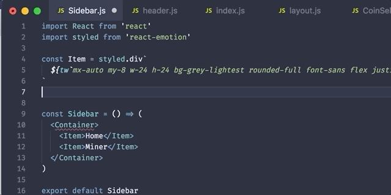

# vscode-tailwind-styled-snippets

## Installation

Follow the [installation steps here](https://marketplace.visualstudio.com/items?itemName=muhajirframe.tailwind-styled-snippets) and reload VSCode

## Usage

Simply write `tail`.

## Release Notes

Users appreciate release notes as you update your extension.

### 1.0.0

Initial release

### For more information

- [Github](https://github.com/muhajirframe/vscode-tailwind-styled-snippets)
- Got a question? [Submit an issue](https://github.com/muhajirframe/vscode-tailwind-styled-snippets/issues/new)

### Contributing

- [Submit an idea](https://github.com/muhajirframe/vscode-tailwind-styled-snippets/issues/new)
- Make a pull request

**Enjoy!**
